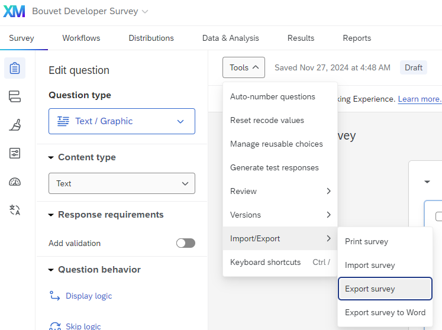
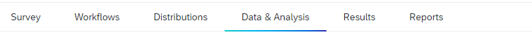
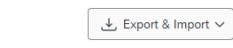
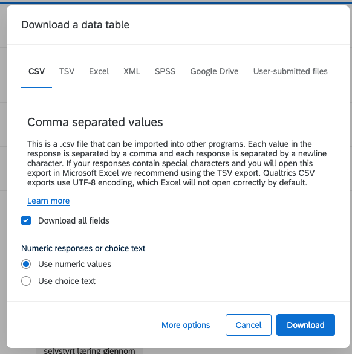

# Bouvet Developer Survey Backend

- Read /docs/GETTING_STARTED.md before reading this.

### Setting up db (Windows only)
The testing and production enviroment uses a Azure Database, but for local development you can use a local database.
For creating a local db and connecting to it, follow these steps:

1. Open cmd and run the following command on this path: `C:\Windows\System32>
    * `sqllocaldb create "Local"`

2. Open Microsoft SQL Server Management Studio and connect to the local db:
    * Server name: (localdb)\Local
    * Authentication: Windows Authentication

3. Create a new database called whatever you want, but for this example we will call it BouvetDeveloperSurvey.

In the secrets.json, add the following connection string:
```json
{
  "ConnectionString": "Server=(localdb)\\Local;Initial Catalog=BouvetDeveloperSurvey;Integrated Security=True"
}
```

Then you can run the api, the database will be connected and migrations to create the tables will be run automatically.

## Connect to Azure OpenAI

The key vault has not been connected to the project yet, but the secrets to connect to the Azure OpenAI API should be stored in the secrets.json file. The OpenAiUrl and OpenAiKey should be stored in the secrets.json file.

```json
{
  "OpenAiUrl": "url",
  "OpenAiSecretKey": "key"
}
```

---

## Exporting the survey from Qualtrics

First of all, we will have to go to https://www.qualtrics.com/ where the survey is located.
We will have to export the survey structure and responses to a file.
* The structure file will be in the format of a .json file.
* The responses file will be in the format of a .csv file.

In order to export the survey structure, go to the survey you want to export and on the Survey tab, click the dropdown menu Tools and then Import/Export. And then click on Export Survey.



When the export is done, we will have a .qsf file that are a json file with the survey structure.

In order to export the survey responses, go to the survey you want to export and on the Data & Analysis tab.



There is a dropdown menu called Export Data. Click on it and then click on Export Data.



Then, use this export functionality to export the responses to a .csv file in the correct format.
It is important to use numeric values, as the .csv file does not provide data on multiple-choice questions if there are choice texts marked as export values!


