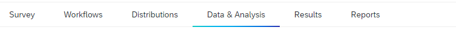
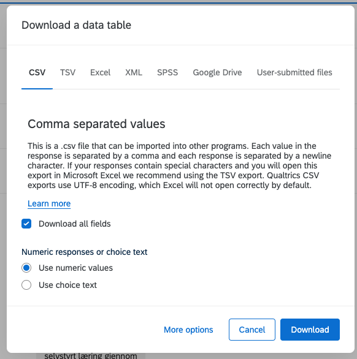

# Qualtrics

The project is currently using qualtrics to host the survey. This guide outlines how to export data from there. To get test data see GETTING_STARTET.md.

## Exporting the survey from Qualtrics

First of all, we will have to go to https://www.qualtrics.com/ where the survey is located.
We will have to export the survey structure and responses to a file.
* The structure file will be in the format of a .json file.
* The responses file will be in the format of a .csv file.

In order to export the survey structure, go to the survey you want to export and on the Survey tab, click the dropdown menu Tools and then Import/Export. And then click on Export Survey.

When the export is done, we will have a .qsf file that are a json file with the survey structure.

In order to export the survey responses, go to the survey you want to export and on the Data & Analysis tab.

There is a dropdown menu called Export Data. Click on it and then click on Export Data.

Then, use this export functionality to export the responses to a .csv file in the correct format.
It is important to use numeric values, as the .csv file does not provide data on multiple-choice questions if there are choice texts marked as export values!

